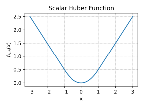
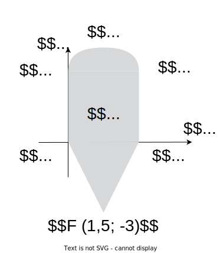

### Linear algebra basics

1. [10 points] **Effect of Diagonal Scaling on Rank** Let $A \in \mathbb{R}^{n \times n}$ be a matrix with rank $r$. Suppose $D \in \mathbb{R}^{n \times n}$ is a diagonal matrix. Determine the rank of the product $DA$. Explain your reasoning.
1. [20 points] Find SVD of the following matrices:

    * $A = \begin{bmatrix} 1\\2\\3 \end{bmatrix}$ 
    * $A = \begin{bmatrix} 1 & 4\\4 & 8\\3 & 8 \end{bmatrix}$ 
    * $A = \begin{bmatrix} 0 & 0\\x & 0\\0 & 0 \end{bmatrix}$, where $x$ is the sum of your birthdate numbers (day + month)

1. [10 points] Assume we have a set of data points $x^{(i)}\in\mathbb{R}^{n},\,i=1,\dots,m$, and decide to represent this data as a matrix

    $$
    X =
        \begin{pmatrix}
        | & & | \\
        x^{(1)} & \dots & x^{(m)} \\
        | & & | \\
        \end{pmatrix} \in \mathbb{R}^{n \times m}.
    $$

    We suppose that $\text{rank}\,X = r$.

    In the problem below, we ask you to find the rank of some matrix $M$ related to $X$.
    In particular, you need to find relation between $\text{rank}\,X = r$ and $\text{rank}\,M$, e.g., that the rank of $M$ is always larger/smaller than the rank of $X$ or that $\text{rank}\,M = \text{rank}\,X \big / 35$.
    Please support your answer with legitimate arguments and make the answer as accurate as possible.

    Note that depending on the structure of the matrix $X$, border cases are possible.
    Make sure to cover them in your answer correctly.

    In applied statistics and machine learning, data is often normalized.
    One particularly popular strategy is to subtract the estimated mean $\mu$ and divide by the square root of the estimated variance $\sigma^2$. i.e.
    
    $$
    x \rightarrow (x - \mu) \big / \sigma.
    $$

    After the normalization, we get a new matrix
    
    $$
        \begin{split}
        Y &:=
        \begin{pmatrix}
            | & & | \\
            y^{(1)} & \dots & y^{(m)} \\
            | & & | \\
        \end{pmatrix},\\
        y^{(i)} &:= \frac{x^{(i)} - \frac{1}{m}\sum_{j=1}^{m} x^{(j)}}{\sqrt{\frac{1}{m}\sum_{j=1}^{m} \left(x^{(j)}\right)^2 - \left(\frac{1}{m}\sum_{j=1}^{m} x^{(j)}\right)^2}}.
        \end{split}
    $$
    
    What is the rank of $Y$ if $\text{rank} \; X = r$?

1. **Image Compression with Truncated SVD** [10 points] Explore image compression using Truncated Singular Value Decomposition (SVD). Understand how varying the number of singular values affects the quality of the compressed image.
    Implement a Python script to compress a grayscale image using Truncated SVD and visualize the compression quality.
    
    * **Truncated SVD**: Decomposes an image $A$ into $U, S,$ and $V$ matrices. The compressed image is reconstructed using a subset of singular values.
    * **Mathematical Representation**: 
    $$
    A \approx U_k \Sigma_k V_k^T
    $$
        * $U_k$ and $V_k$ are the first $k$ columns of $U$ and $V$, respectively.
        * $\Sigma_k$ is a diagonal matrix with the top $k$ singular values.
        * **Relative Error**: Measures the fidelity of the compressed image compared to the original. 
    
        $$
        \text{Relative Error} = \frac{\| A - A_k \|}{\| A \|}
        $$

    ```python
    import matplotlib.pyplot as plt
    import matplotlib.animation as animation
    import numpy as np
    from skimage import io, color
    import requests
    from io import BytesIO

    def download_image(url):
        response = requests.get(url)
        img = io.imread(BytesIO(response.content))
        return color.rgb2gray(img)  # Convert to grayscale

    def update_plot(i, img_plot, error_plot, U, S, V, original_img, errors, ranks, ax1, ax2):
        # Adjust rank based on the frame index
        if i < 70:
            rank = i + 1
        else:
            rank = 70 + (i - 69) * 10

           
        reconstructed_img = ... # YOUR CODE HERE 

        # Calculate relative error
        relative_error = ... # YOUR CODE HERE
        errors.append(relative_error)
        ranks.append(rank)

        # Update the image plot and title
        img_plot.set_data(reconstructed_img)
        ax1.set_title(f"Image compression with SVD\n Rank {rank}; Relative error {relative_error:.2f}")

        # Remove axis ticks and labels from the first subplot (ax1)
        ax1.set_xticks([])
        ax1.set_yticks([])

        # Update the error plot
        error_plot.set_data(ranks, errors)
        ax2.set_xlim(1, len(S))
        ax2.grid(linestyle=":")
        ax2.set_ylim(1e-4, 0.5)
        ax2.set_ylabel('Relative Error')
        ax2.set_xlabel('Rank')
        ax2.set_title('Relative Error over Rank')
        ax2.semilogy()

        # Set xticks to show rank numbers
        ax2.set_xticks(range(1, len(S)+1, max(len(S)//10, 1)))  # Adjust the step size as needed
        plt.tight_layout()

        return img_plot, error_plot


    def create_animation(image, filename='svd_animation.mp4'):
        U, S, V = np.linalg.svd(image, full_matrices=False)
        errors = []
        ranks = []

        fig, (ax1, ax2) = plt.subplots(2, 1, figsize=(5, 8))
        img_plot = ax1.imshow(image, cmap='gray', animated=True)
        error_plot, = ax2.plot([], [], 'r-', animated=True)  # Initial empty plot for errors

        # Add watermark
        ax1.text(1, 1.02, '@fminxyz', transform=ax1.transAxes, color='gray', va='bottom', ha='right', fontsize=9)

        # Determine frames for the animation
        initial_frames = list(range(70))  # First 70 ranks
        subsequent_frames = list(range(70, len(S), 10))  # Every 10th rank after 70
        frames = initial_frames + subsequent_frames

        ani = animation.FuncAnimation(fig, update_plot, frames=len(frames), fargs=(img_plot, error_plot, U, S, V, image, errors, ranks, ax1, ax2), interval=50, blit=True)
        ani.save(filename, writer='ffmpeg', fps=8, dpi=300)

    # URL of the image
    url = ""

    # Download the image and create the animation
    image = download_image(url)
    create_animation(image)
    ```

### Matrix calculus

1. [10 points] Given a matrix $A$ of size $m \times n$ and a vector $x$ of size $n \times 1$, compute the gradient of the function $f(x) = \text{tr}(A^T A x x^T)$ with respect to $x$.
1. [10 points] Find the gradient $\nabla f(x)$ and hessian $f''(x)$, if $f(x) = \dfrac{1}{2} \Vert Ax - b\Vert^2_2$.
1. [10 points] Find the gradient $\nabla f(x)$ and hessian $f''(x)$, if 
    $$
    f(x) = \frac1m \sum\limits_{i=1}^m \log \left( 1 + \exp(a_i^{T}x) \right) + \frac{\mu}{2}\Vert x\Vert _2^2, \; a_i, x \in \mathbb R^n, \; \mu>0
    $$
1. [10 points] Compute the gradient $\nabla_A f(A)$ of the trace of the matrix exponential function $f(A) = \text{tr}(e^A)$ with respect to $A$. Hint: hint: Use the definition of the matrix exponential. Use the definition of the differential $df = f(A + dA) - f(A) + o(\Vert dA \Vert)$ with the limit $\Vert dA \Vert \to 0$.
1. [10 points] Calculate the first and the second derivative of the following function $f : S \to \mathbb{R}$

    $$
    f(t) = \text{det}(A − tI_n),
    $$

### Automatic differentiation

1. [10 points] You will work with the following function for this exercise,
    $$
    f(x,y)=e^{−\left(sin(x)−cos(y)\right)^2}
    $$  
    Draw the computational graph for the function. Note, that it should contain only primitive operations - you need to do it automatically -  [jax example](https://bnikolic.co.uk/blog/python/jax/2022/02/22/jax-outputgraph-rev.html), [PyTorch example](https://github.com/waleedka/hiddenlayer) - you can google/find your way to visualize it.

1. [10 points] Compare analytic and autograd (with any framework) approach for the calculation of the gradient of:      
    $$
    f(A) = \text{tr}(e^A)
    $$
1. [10 points] We can use automatic differentiation not only to calculate necessary gradients but also for tuning hyperparameters of the algorithm like learning rate in gradient descent (with gradient descent 🤯). Suppose, we have the following function $f(x) = \frac{1}{2}\Vert x\Vert^2$, select a random point $x_0 \in \mathbb{B}^{1000} = \{0 \leq x_i \leq 1 \mid \forall i\}$. Consider $10$ steps of the gradient descent starting from the point $x_0$:
    $$
    x_{k+1} = x_k - \alpha_k \nabla f(x_k)
    $$
    Your goal in this problem is to write the function, that takes $10$ scalar values $\alpha_i$ and return the result of the gradient descent on function $L = f(x_{10})$. And optimize this function using gradient descent on $\alpha \in \mathbb{R}^{10}$. Suppose that each of $10$ components of $\alpha$ is uniformly distributed on $[0; 0.1]$.
    $$
    \alpha_{k+1} = \alpha_k - \beta \frac{\partial L}{\partial \alpha}
    $$
    Choose any constant $\beta$ and the number of steps you need. Describe the obtained results. How would you understand, that the obtained schedule ($\alpha \in \mathbb{R}^{10}$) becomes better than it was at the start? How do you check numerically local optimality in this problem? 
1. [10 points] Compare analytic and autograd (with any framework) approach for the gradient of:     
    $$
    f(X) = - \log \det X
    $$

### Convexity

1. [5 points] The center of mass of a body is an important concept in physics (mechanics). Obviously, the center of mass of a body does not always lie inside the body. For example, the center of mass of a doughnut is located in its hole. Prove that the center of mass of a system of material points lies in the convex hull of the set of these points.
1. [10 points] Show, that $\mathbf{conv}\{xx^\top: x \in \mathbb{R}^n, \Vert x\Vert  = 1\} = \{A \in \mathbb{S}^n_+: \text{tr}(A) = 1\}$.
1. [5 points] Prove that the set of $\{x \in \mathbb{R}^2 \mid e^{x_1}\le x_2\}$ is convex.
1. [5 points] Show that the set of directions of the non-strict local descending of the differentiable function in a point is a convex cone. We assume, that $\nabla f(x_0) \neq 0$ at the target point.
1. [10 points] Is the following set convex
    $$
    S = \left\{ a \in \mathbb{R}^k \mid p(0) = 1, \vert p(t) \vert\leq 1 \text{ for } \alpha\leq t \leq \beta\right\},
    $$
    where
    $$
    p(t) = a_1 + a_2 t + \ldots + a_k t^{k-1} \;?
    $$

1. [10 points] Consider the function $f(x) = x^d$, where $x \in \mathbb{R}_{+}$. Fill the following table with ✅ or ❎. Explain your answers

    | $d$ | Convex | Concave | Strictly Convex | $\mu$-strongly convex |
    |:-:|:-:|:-:|:-:|:-:|
    | $-2, x \in \mathbb{R}_{++}$| | | | |
    | $-1, x \in \mathbb{R}_{++}$| | | | |
    | $0$| | | | |
    | $0.5$ | | | | |
    |$1$ | | | | |
    | $\in (1; 2)$ | | | | |
    | $2$| | | | |
    | $> 2$| | | | 

    : {.responsive}

1. [10 points] Prove that the entropy function, defined as

    $$
    f(x) = -\sum_{i=1}^n x_i \log(x_i),
    $$

    with $\text{dom}(f) = \{x \in \R^n_{++} : \sum_{i=1}^n x_i = 1\}$, is strictly concave.  

1. [10 points] Show, that the function $f: \mathbb{R}^n_{++} \to \mathbb{R}$ is convex if $f(x) = - \prod\limits_{i=1}^n x_i^{\alpha_i}$ if $\mathbf{1}^T \alpha = 1, \alpha \succeq 0$.

1. [10 points] Show that the maximum of a convex function $f$ over the polyhedron $P = \text{conv}\{v_1, \ldots, v_k\}$ is achieved at one of its vertices, i.e.,

    $$
    \sup_{x \in P} f(x) = \max_{i=1, \ldots, k} f(v_i).
    $$

    A stronger statement is: the maximum of a convex function over a closed bounded convex set is achieved at an extreme point, i.e., a point in the set that is not a convex combination of any other points in the set. (you do not have to prove it). *Hint:* Assume the statement is false, and use Jensen’s inequality.

1. [10 points] Show, that the two definitions of $\mu$-strongly convex functions are equivalent:
    1. $f(x)$ is $\mu$-strongly convex $\iff$ for any $x_1, x_2 \in S$ and $0 \le \lambda \le 1$ for some $\mu > 0$:
        
        $$
        f(\lambda x_1 + (1 - \lambda)x_2) \le \lambda f(x_1) + (1 - \lambda)f(x_2) - \frac{\mu}{2} \lambda (1 - \lambda)\|x_1 - x_2\|^2
        $$

    1. $f(x)$ is $\mu$-strongly convex $\iff$ if there exists $\mu>0$ such that the function $f(x) - \dfrac{\mu}{2}\Vert x\Vert^2$ is convex.


---

### Conjugate sets

1. [5 points] Let $\mathbb{A}_n$ be the set of all $n$ dimensional antisymmetric matrices (s.t. $X^T = - X$). Show that $\left( \mathbb{A}_n\right)^* = \mathbb{S}_n$. 
1. [10 points] Find the sets $S^{*}, S^{**}, S^{***}$, if 
    
    $$
    S = \{ x \in \mathbb{R}^2 \mid 2x_1 + x_2 \ge -2, \;\; x_1 - 2 x_2 \le 4, \;\;  x_2 \ge 0 \;\; x_1 + x_2 \ge -3\}
    $$

1. [10 points] Find the conjugate set to the ellipsoid: 
    
    $$
     S = \left\{ x \in \mathbb{R}^n \mid \sum\limits_{i = 1}^n a_i^2 x_i^2 \le \varepsilon^2 \right\}
    $$

### Conjugate functions

1. [5 points] Find $f^*(y)$, if $f(x) = \vert \frac12x \vert$
1. [10 points] Find $f^*(y)$, if $f(x) = \log \left( \sum\limits_{i=1}^n e^{x_i} \right)$
1. [10 points] Prove, that if $f(x) = g(Ax)$, then $f^*(y) = g^*(A^{-\top}y)$
1. [15 points] Find $f^*(Y)$, if $f(X) = - \ln \det X, X \in \mathbb{S}^n_{++}$
1. [15 points] The scalar Huber function is defined as

    $$
    f_{\text{hub}}(x) = 
    \begin{cases} 
    \frac{1}{2} x^2 & \text{if } |x| \leq 1 \\
    |x| - \frac{1}{2} & \text{if } |x| > 1
    \end{cases}
    $$

    

    This convex function arises in various applications, notably in robust estimation. This problem explores the generalizations of the Huber function to $\mathbb{R}^n$. A straightforward extension to $\mathbb{R}^n$ is expressed as $f_{\text{hub}}(x_1) + \ldots + f_{\text{hub}}(x_n)$, yet this formulation is not circularly symmetric, that is, it's not invariant under the transformation of $x$ by an orthogonal matrix. A circularly symmetric extension to $\mathbb{R}^n$ is given by

    $$
    f_{\text{cshub}}(x) = f_{\text{hub}}(\Vert x\Vert )= 
    \begin{cases} 
    \frac{1}{2} \Vert x\Vert_2 ^2 & \text{if } \Vert x\Vert_2 \leq 1 \\
    \Vert x\Vert_2 - \frac{1}{2} & \text{if } \Vert x\Vert_2 > 1
    \end{cases}
    $$

    where the subscript denotes "circularly symmetric Huber function". Show, that $f_{\text{cshub}}$ is convex. Find the conjugate function $f^*(y)$.

1. [15 points] Prove that $f^{**}$ is the pointwise maximum of all affine functions that underestimate $f$, i.e., 
    $$
    f^{**}(x) = \max \{ g(x) : \text{$g$ is affine, $g \leq f$}\}.
    $$

1. [15 points] Derive the conjugate function of $f(\theta)=\sum_{i=1}^n \log(1+e^{-y_i\theta_i})$, where $y_i \in \{-1,1\}$. 

### Subgradients

1. [5 points] Find $\partial f(x)$, if 
    $$
    f(x) = \text{Parametric ReLU}(x) = \begin{cases}
        x & \text{if } x > 0, \\
        ax & \text{otherwise}.
    \end{cases}
    $$
1. [10 points] Find $\partial f(x)$, if $f(x) = \Vert Ax - b\Vert _1$.
1. [10 points] Find $\partial f(x)$, if $f(x) = e^{\Vert x\Vert}$.
1. [10 points] Find $\partial f(x)$, if $f(x) = \frac12 \Vert Ax - b\Vert _2^2 + \lambda \Vert x\Vert_1, \quad \lambda > 0$.
1. [5 points] Let $S \subseteq \mathbb{R}^n$ be a convex set. We will call a *normal cone* of the set $S$ at a point $x$ the following set:
    $$
    N_S(x) = \left\{c \in \mathbb{R}^n : \langle c, y-x\rangle \leq 0 \quad \forall y \in S\right\}
    $$
    i) Draw a normal cone for a set at the points $A, B, C, D, E, F$ on the figure below: 
    
        
    
    i) Show, that $N_S(x) = \{0\} \quad \forall x \in \mathbf{i }(S)$.

1. [15 points] For $f(X) = \|X\|_{\text{tr}}$, show that subgradients at $X=U \Sigma V^T$ (this is an SVD of $X$) satisfy 
    $$
    \partial f(X) \supseteq \{UV^T + W : \|W\|_{\mathrm{op}} \leq 1, \;
    U^T W = 0, \; WV = 0 \}.
    $$
    Hint: you may use the fact that $\|\cdot\|_{\text{tr}}$ and $\|\cdot\|_{\mathrm{op}}$ are dual norms, which implies $\langle A, B \rangle \leq \|A\|_{\text{tr}}\|B\|_{\mathrm{op}}$ for any matrices $A,B$, where recall $\langle A,B \rangle = \text{tr}(A^T B)$.  **Bonus (5 pts):** prove the other direction.   

### Optimality Conditions. KKT

In this section, you can consider either the arbitrary norm or the Euclidian norm if nothing else is specified.

1. **Toy example** [10 points] 
    $$
    \begin{split}
    & x^2 + 1 \to \min\limits_{x \in \mathbb{R} }\\
    \text{s.t. } & (x-2)(x-4) \leq 0
    \end{split}
    $$

    1. Give the feasible set, the optimal value, and the optimal solution.
    1.  Plot the objective $x^2 +1$ versus $x$. On the same plot, show the feasible set, optimal point, and value, and plot the Lagrangian $L(x,\mu)$ versus $x$ for a few positive values of $\mu$. Verify the lower bound property ($p^* \geq \inf_x L(x, \mu)$for $\mu \geq 0$). Derive and sketch the Lagrange dual function $g$.
    1. State the dual problem, and verify that it is a concave maximization problem. Find the dual optimal value and dual optimal solution $\mu^*$. Does strong duality hold?
    1.  Let $p^*(u)$ denote the optimal value of the problem

    $$
    \begin{split}
    & x^2 + 1 \to \min\limits_{x \in \mathbb{R} }\\
    \text{s.t. } & (x-2)(x-4) \leq u
    \end{split}
    $$

    as a function of the parameter $u$. Plot $p^*(u)$. Verify that $\dfrac{dp^*(0)}{du} = -\mu^*$ 


1. [10 points] Give an explicit solution to the following LP.
    
    $$
    \begin{split}
    & c^\top x \to \min\limits_{x \in \mathbb{R}^n }\\
    \text{s.t. } & 1^\top x = 1, \\
    & x \succeq 0 
    \end{split}
    $$

    This problem can be considered the simplest portfolio optimization problem.

1. [20 points] Show, that the following problem has a unique solution and find it:

    $$
    \begin{split}
    & \langle C^{-1}, X\rangle - \log \det X \to \min\limits_{x \in \mathbb{R}^{n \times n} }\\
    \text{s.t. } & \langle Xa, a\rangle \leq 1,
    \end{split}
    $$

    where $C \in \mathbb{S}^n_{++}, a \in \mathbb{R}^n \neq 0$. The answer should not involve inversion of the matrix $C$.

1. [20 points] Derive the KKT conditions for the problem
    
    $$
    \begin{split}
    & \mathbf{tr \;}X - \log\text{det }X \to \min\limits_{X \in \mathbb{S}^n_{++} }\\
    \text{s.t. } & Xs = y,
    \end{split}
    $$

    where $y \in \mathbb{R}^n$ and $s \in \mathbb{R}^n$ are given with $y^\top s = 1$. Verify that the optimal solution is given by

    $$
    X^* = I + yy^\top - \dfrac{1}{s^\top s}ss^\top
    $$
    


### Duality

1. [10 points] Derive the dual problem for the Ridge regression problem with $A \in \mathbb{R}^{m \times n}, b \in \mathbb{R}^m, \lambda > 0$:

    $$
    \begin{split}
    \dfrac{1}{2}\|y-b\|^2 + \dfrac{\lambda}{2}\|x\|^2 &\to \min\limits_{x \in \mathbb{R}^n, y \in \mathbb{R}^m }\\
    \text{s.t. } & y = Ax
    \end{split}
    $$

1. [20 points] Derive the dual problem for the support vector machine problem with $A \in \mathbb{R}^{m \times n}, \mathbf{1} \in \mathbb{R}^m \in \mathbb{R}^m, \lambda > 0$:

    $$
    \begin{split}
    \langle \mathbf{1}, t\rangle + \dfrac{\lambda}{2}\|x\|^2 &\to \min\limits_{x \in \mathbb{R}^n, t \in \mathbb{R}^m }\\
    \text{s.t. } & Ax \succeq \mathbf{1} - t \\
    & t \succeq 0
    \end{split}
    $$

1. [20 points] **Analytic centering.** Derive a dual problem for
    
    $$
    -\sum_{i=1}^m \log (b_i - a_i^\top x) \to \min\limits_{x \in \mathbb{R}^{n} }
    $$

    with domain $\{x \mid a^\top_i x < b_i , i = [1,m]\}$. 
    
    First introduce new variables $y_i$ and equality constraints $y_i = b_i − a^\top_i x$. (The solution to this problem is called the analytic center of the linear inequalities $a^\top_i x \leq b_i ,i = [1,m]$.  Analytic centers have geometric applications, and play an important role in barrier methods.) 

### Linear Programming

1. [20 points] **📱🎧💻 Covers manufacturing.** Lyzard Corp is producing covers for the following products: 
    * 📱 phones
    * 🎧 headphones
    * 💻 laptops

    The company’s production facilities are such that if we devote the entire production to headphone covers, we can produce 5000 of them in one day. If we devote the entire production to phone covers or laptop covers, we can produce 4000 or 2000 of them in one day. 

    The production schedule is one week (6 working days), and the week’s production must be stored before distribution. Storing 1000 headphone covers (packaging included) takes up 30 cubic feet of space. Storing 1000 phone covers (packaging included) takes up 50 cubic feet of space, and storing 1000 laptop covers (packaging included) takes up 220 cubic feet of space. The total storage space available is 1500 cubic feet. 
    
    Due to commercial agreements with Lyzard Corp has to deliver at least 4500 headphone covers and 4000 laptop covers per week to strengthen the product’s diffusion. 

    The marketing department estimates that the weekly demand for headphones covers, phone, and laptop covers does not exceed 10000 14000, and 7000 units, therefore the company does not want to produce more than these amounts for headphones, phone, and laptop covers. 

    Finally, the net profit per headphone cover, phone cover, and laptop cover are \$5, \$7, and \$12, respectively.

    The aim is to determine a weekly production schedule that maximizes the total net profit.

    1. Write a Linear Programming formulation for the problem.  Use the following variables:

        * $y_1$ = number of headphones covers produced over the week,  
        * $y_2$ = number of phone covers produced over the week,  
        * $y_3$ = number of laptop covers produced over the week. 

    1. Find the solution to the problem using [PyOMO](http://www.pyomo.org)
    
        ```python
        !pip install pyomo
        ! sudo apt-get install glpk-utils --quiet  # GLPK
        ! sudo apt-get install coinor-cbc --quiet  # CoinOR
        ```

    1. Perform the sensitivity analysis. Which constraint could be relaxed to increase the profit the most? Prove it numerically.

1. [10 points] Prove the optimality of the solution 
    
    $$
    x = \left(\frac{7}{3} , 0, \frac{1}{3}\right)^T
    $$
    
    to the following linear programming problem:
    
    $$
    \begin{split}
    & 9x_1 + 3x_2 + 7x_3 \to \max\limits_{x \in \mathbb{R}^3 }\\
    \text{s.t. } & 2x_1 + x_2 + 3x_3 \leq 6 \\
    & 5x_1 + 4x_2 + x_3 \leq 12 \\
    & 3x_3 \leq 1,\\
    & x_1, x_2, x_3 \geq 0
    \end{split}
    $$

    but you cannot use any numerical algorithm here.

1. [5 points] Transform the following linear program into an equivalent linear program in the standard form $\left(c^\top x \to \min\limits_{x\in \mathbb{R}^n} : Ax = b,x ≥ 0\right)$:

    $$
    \begin{split}
    & x_1−x_2 \to \min\limits_{x \in \mathbb{R}^2 }\\
    \text{s.t. } & 2x_1 + x_2 \geq 3 \\
    & 3x_1 − x_2 \leq 7 \\
    & x_1 \geq 0
    \end{split}
    $$

1. [20 points] Economic interpretation of the dual problem: Suppose a small shop makes wooden toys, where each toy train requires one piece of wood and $2$ tins of paint, while each toy boat requires one piece of wood and $1$ tin of paint. The profit on each toy train is $\$30$, and the profit on each toy boat is $\$20$. Given an inventory of $80$ pieces of wood and $100$ tins of paint, how many of each toy
should be made to maximize the profit?
    1. Write out the optimization problem in standard form, writing all constraints as inequalities.
    1. Sketch the feasible set and determine $p^*$ and $x^*$
    1. Find the dual problem, then determine $d^*$ and $\lambda^*$. Note that we can interpret the Lagrange multipliers $\lambda_k$ associated with the constraints on wood and paint as the prices for each piece of wood and tin of paint, so that $−d^*$ is how much money would be obtained from selling the inventory for those prices. Strong duality says a buyer should not pay more for the inventory than what the toy store would make by producing and selling toys from it, and that the toy store should not sell the inventory for less than that.
    1. The other interpretation of the Lagrange multipliers is as sensitivities to changes in the constraints. Suppose the toymaker found some more pieces of wood; the $\lambda_k$ associated with the wood constraint will equal the partial derivative of $−p^*$ with respect to how much more wood became available. Suppose the inventory increases by one piece of wood. Use $\lambda^*$ to estimate how much the profit would increase, without solving the updated optimization problem. How is this consistent with the price interpretation given above for the Lagrange multipliers? [source](https://tleise.people.amherst.edu/Math294Spring2017/TeXfiles/LagrangeDualityHW.pdf) 

### Sequence convergence

1. [15 points] Determine the convergence or divergence of a given sequences

    * $r_{k} = \frac{1}{\sqrt{k}}$.
    * $r_{k} = 0.707^k$.
    * $r_{k} = 0.707^{2^k}$.

1. [10 points] Determine the convergence or divergence of a given sequence $r_k =\begin{cases} \frac{1}{k}, & \text{if } k\text{ is even} \\ e^{-k}, & \text{if } k\text{ is odd} \end{cases}$.

1. [10 points] Determine the following sequence $\{r_k\}$ by convergence rate (linear, sublinear, superlinear). In the case of superlinear convergence, additionally, find out whether there is quadratic convergence.

    $$
    r_k = \dfrac{1}{k!}
    $$

1. [10 points] Determine the following sequence $\{r_k\}$ by convergence rate (linear, sublinear, superlinear). In the case of superlinear convergence, additionally find out whether there is quadratic convergence.

    $$
    r_k = \dfrac{1}{k^k}
    $$

1. [15 points] Let $\left\{ r_k \right\}_{k=m}^\infty$ be a sequence of non-negative numbers and let $s > 0$ be some integer. Prove that sequence $\left\{ r_k \right\}_{k=m+s}^\infty$ is linearly convergent with constant $q$ if and only if a the sequence $\left\{ r_k \right\}_{k=m}^\infty$ converged linearly with constant $q$.

### Line search

1. [10 points] Consider a quadratic function $f: \mathbb{R}^n \rightarrow \mathbb{R}$, and let us start from a point $x_k \in \mathbb{R}^n$ moving in the direction of the antigradient $-\nabla f(x_k)$. Show that the minimum of $f$ along this direction as a function of the step size $\alpha$, for a decreasing function at $x_k$, satisfies Armijo's condition for any $c_1$ in the range $0 \leq c_1 \leq \frac{1}{2}$. Specifically, demonstrate that the following inequality holds at the optimal $\alpha^*$:

   $$
   \varphi(\alpha) = f(x_{k+1}) = f(x_k - \alpha \nabla f(x_k)) \leq f(x_k) - c_1 \alpha \|\nabla f(x_k)\|_2^2
   $$

1. **Implementing and Testing Line Search Conditions in Gradient Descent** [30 points] 

    $$
    x_{k+1} = x_k - \alpha \nabla f(x_k)
    $$
    
    In this assignment, you will modify an existing Python code for gradient descent to include various line search conditions. You will test these modifications on two functions: a quadratic function and the Rosenbrock function. The main objectives are to understand how different line search strategies influence the convergence of the gradient descent algorithm and to compare their efficiencies based on the number of function evaluations.

    ```python
    import numpy as np
    import matplotlib.pyplot as plt
    from scipy.optimize import minimize_scalar
    np.random.seed(214)

    # Define the quadratic function and its gradient
    def quadratic_function(x, A, b):
        return 0.5 * np.dot(x.T, np.dot(A, x)) - np.dot(b.T, x)

    def grad_quadratic(x, A, b):
        return np.dot(A, x) - b

    # Generate a 2D quadratic problem with a specified condition number
    def generate_quadratic_problem(cond_number):
        # Random symmetric matrix
        M = np.random.randn(2, 2)
        M = np.dot(M, M.T)

        # Ensure the matrix has the desired condition number
        U, s, V = np.linalg.svd(M)
        s = np.linspace(cond_number, 1, len(s))  # Spread the singular values
        A = np.dot(U, np.dot(np.diag(s), V))

        # Random b
        b = np.random.randn(2)

        return A, b

    # Gradient descent function
    def gradient_descent(start_point, A, b, stepsize_func, max_iter=100):
        x = start_point.copy()
        trajectory = [x.copy()]

        for i in range(max_iter):
            grad = grad_quadratic(x, A, b)
            step_size = stepsize_func(x, grad)
            x -= step_size * grad
            trajectory.append(x.copy())

        return np.array(trajectory)

    # Backtracking line search strategy using scipy
    def backtracking_line_search(x, grad, A, b, alpha=0.3, beta=0.8):
        def objective(t):
            return quadratic_function(x - t * grad, A, b)
        res = minimize_scalar(objective, method='golden')
        return res.x

    # Generate ill-posed problem
    cond_number = 30
    A, b = generate_quadratic_problem(cond_number)

    # Starting point
    start_point = np.array([1.0, 1.8])

    # Perform gradient descent with both strategies
    trajectory_fixed = gradient_descent(start_point, A, b, lambda x, g: 5e-2)
    trajectory_backtracking = gradient_descent(start_point, A, b, lambda x, g: backtracking_line_search(x, g, A, b))

    # Plot the trajectories on a contour plot
    x1, x2 = np.meshgrid(np.linspace(-2, 2, 400), np.linspace(-2, 2, 400))
    Z = np.array([quadratic_function(np.array([x, y]), A, b) for x, y in zip(x1.flatten(), x2.flatten())]).reshape(x1.shape)

    plt.figure(figsize=(10, 8))
    plt.contour(x1, x2, Z, levels=50, cmap='viridis')
    plt.plot(trajectory_fixed[:, 0], trajectory_fixed[:, 1], 'o-', label='Fixed Step Size')
    plt.plot(trajectory_backtracking[:, 0], trajectory_backtracking[:, 1], 'o-', label='Backtracking Line Search')

    # Add markers for start and optimal points
    plt.plot(start_point[0], start_point[1], 'ro', label='Start Point')
    optimal_point = np.linalg.solve(A, b)
    plt.plot(optimal_point[0], optimal_point[1], 'y*', markersize=15, label='Optimal Point')

    plt.legend()
    plt.title('Gradient Descent Trajectories on Quadratic Function')
    plt.xlabel('x1')
    plt.ylabel('x2')
    plt.savefig("linesearch.svg")
    plt.show()
    ```

    

    Start by reviewing the provided Python code. This code implements gradient descent with a fixed step size and a backtracking line search on a quadratic function. Familiarize yourself with how the gradient descent function and the step size strategies are implemented.

    1. Modify the gradient descent function to include the following line search conditions:
        
        a. Sufficient Decrease Condition
        b. Curvature Condition
        c. Goldstein Condition
        d. Wolfe Condition
        e. Dichotomy
        
        Test your modified gradient descent algorithm with the implemented line search conditions on the provided quadratic function. Plot the trajectories over iterations for each condition. Choose and specify hyperparameters for inexact line search condition. Choose and specify the termination criterion. Start from the point $x_0 = (-1, 2)^T$.

    1. Compare these 7 methods from the budget perspective. Plot the graph of function value from the number of function evaluations for each method on the same graph.

    1. Plot trajectory for another function with the same set of methods
    
        $$
        f(x_1, x_2) =  10(x_2 − x_1^2)^2 + (x_1 − 1)^2
        $$

        with $x_0 = (-1, 2)^T$. You might need to adjust hyperparameters.

    1. Plot the same function value from the number of function calls for this experiment.